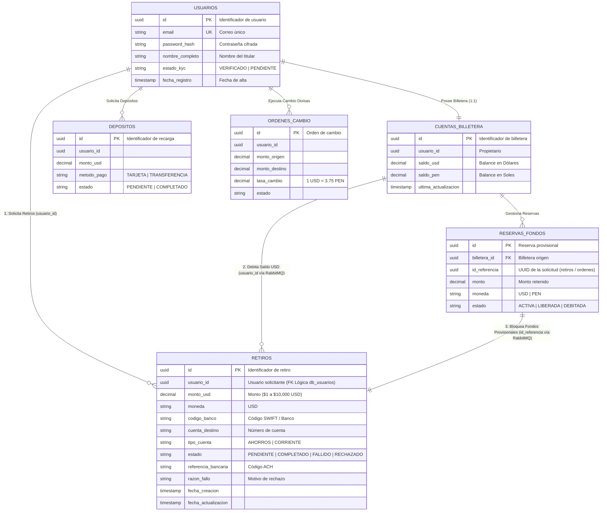

# 🛢️ Arquitectura Global de Bases de Datos del Sistema

Este documento describe la **Arquitectura Global de Bases de Datos** para la plataforma de Billetera Digital, basada en el patrón **Database per Service**.

---

## 🏗️ 1. Diagrama Entidad-Relación Global (Multi-Database System)

---

## 📋 2. Catálogo de Bases de Datos del Ecosistema

| Base de Datos | Servicio Propietario | Motor DB | Tablas / Entidades | Estado de Implementación |
| :--- | :--- | :--- | :--- | :---: |
| **`db_usuarios`** | Servicio Usuarios & KYC | PostgreSQL 15 | `usuarios`, `perfiles_kyc` | Especificación / Macro |
| **`db_billetera`** | Servicio Billetera & Saldos | PostgreSQL 15 | `cuentas_billetera`, `reservas_fondos` | Especificación / Macro |
| **`db_depositos`** | Servicio Depósitos | PostgreSQL 15 | `depositos` | Especificación / Macro |
| **`db_servicio_retiros_usd`** | **Servicio de Retiros USD** | **PostgreSQL 15** | **`retiros`** | **100% Activo (Taller 2)** |
| **`db_cambio_divisas`** | Servicio Cambio USD/PEN | PostgreSQL 15 | `ordenes_cambio` | Especificación / Macro |

---

## 🔒 3. Principios de Aislamiento y Persistencia

1. **Database per Service**: Ningún microservicio tiene acceso directo a las tablas de otro servicio ni realiza consultas `JOIN` entre bases de datos distintas.
2. **Comunicación Orientada a Eventos**: La sincronización de estados financieros entre servicios se efectúa mediante eventos en **RabbitMQ** (`withdrawal.requested`, `withdrawal.completed`, `withdrawal.failed`).
3. **Escalabilidad Independiente**: Cada base de datos se despliega en su propio contenedor/volumen Docker PostgreSQL 15.
