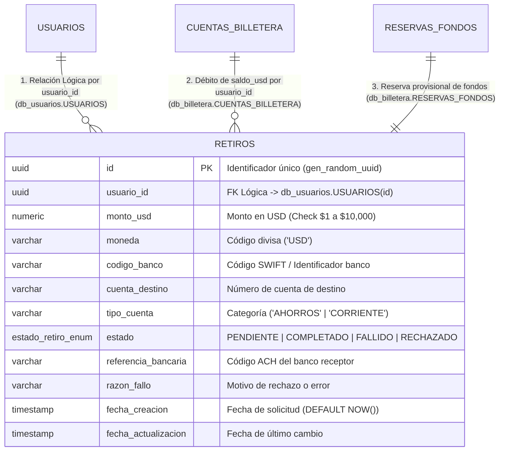
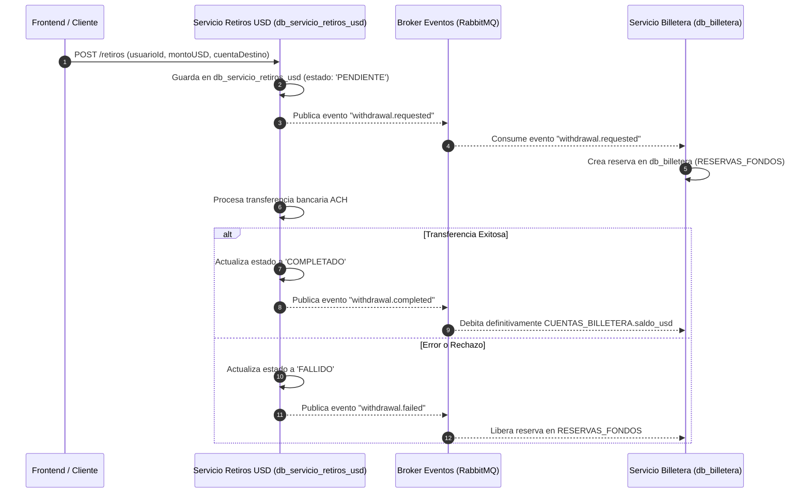

# 🛢️ Especificación de Base de Datos: Servicio de Retiros USD (`db_servicio_retiros_usd`)

Este documento describe de forma exclusiva el diseño relacional, funciones, restricciones, integración por eventos e implementación ORM de la base de datos **`db_servicio_retiros_usd`**, correspondiente al microservicio implementado en el **Taller 2 - Microservicios**.

---

## 📊 1. Diagrama Entidad-Relación Específico (ERD)



---

## 🛠️ 2. Funciones, Tipos y Restricciones de PostgreSQL

La base de datos utiliza funciones nativas y restricciones avanzadas de PostgreSQL 15:

### **A. Funciones y Extensiones Utilizadas**
- **`gen_random_uuid()`**: Función nativa de PostgreSQL 15 para la generación automática de claves primarias UUID v4 sin colisión.
- **`CURRENT_TIMESTAMP` / `NOW()`**: Función para asignar automáticamente marcas de tiempo de auditoría a `fecha_creacion` y `fecha_actualizacion`.

### **B. Tipos Personalizados (ENUM Types)**
- **`estado_retiro_enum`**: Tipo de enumeración nativo en PostgreSQL para restringir los valores de estado a nivel de motor:
  ```sql
  CREATE TYPE estado_retiro_enum AS ENUM (
    'PENDIENTE',
    'EN_PROCESO',
    'COMPLETADO',
    'RECHAZADO',
    'FALLIDO'
  );
  ```

### **C. Restricciones de Integridad (CHECK Constraints)**
- **`chk_monto_usd_rango`**: Restricción financiera que garantiza a nivel de base de datos que no se registren montos negativos, nulos o superiores a $10,000 USD:
  ```sql
  CONSTRAINT chk_monto_usd_rango CHECK (monto_usd >= 1.00 AND monto_usd <= 10000.00)
  ```

### **D. Índices de Rendimiento (B-Tree Indexes)**
- **`idx_retiros_usuario_id`**: Índice sobre `usuario_id` para acelerar las consultas de historial (`GET /retiros/usuario/:usuarioId`).
- **`idx_retiros_estado`**: Índice sobre `estado` para agilizar el filtrado de transacciones pendientes y completadas.

---

## 📜 3. Script SQL DDL de Creación

```sql
-- 1. Crear Tipo ENUM
CREATE TYPE estado_retiro_enum AS ENUM (
  'PENDIENTE',
  'EN_PROCESO',
  'COMPLETADO',
  'RECHAZADO',
  'FALLIDO'
);

-- 2. Crear Tabla de Retiros
CREATE TABLE retiros (
    id UUID PRIMARY KEY DEFAULT gen_random_uuid(),
    usuario_id UUID NOT NULL,
    monto_usd NUMERIC(12, 2) NOT NULL CONSTRAINT chk_monto_usd_rango CHECK (monto_usd >= 1.00 AND monto_usd <= 10000.00),
    moneda VARCHAR(3) NOT NULL DEFAULT 'USD',
    codigo_banco VARCHAR(50) NOT NULL,
    cuenta_destino VARCHAR(50) NOT NULL,
    tipo_cuenta VARCHAR(20) NOT NULL DEFAULT 'AHORROS',
    estado estado_retiro_enum NOT NULL DEFAULT 'PENDIENTE',
    referencia_bancaria VARCHAR(100),
    razon_fallo VARCHAR(255),
    fecha_creacion TIMESTAMP WITH TIME ZONE DEFAULT CURRENT_TIMESTAMP,
    fecha_actualizacion TIMESTAMP WITH TIME ZONE DEFAULT CURRENT_TIMESTAMP
);

-- 3. Crear Índices B-Tree
CREATE INDEX idx_retiros_usuario_id ON retiros(usuario_id);
CREATE INDEX idx_retiros_estado ON retiros(estado);
```

---

## ⚙️ 4. Funciones del Repositorio ORM TypeORM (`RepositorioRetiroAdaptador`)

El adaptador de persistencia interactúa con la base de datos mediante cuatro funciones principales:

1. **`guardar(retiro: Retiro)`**: Mapea la entidad de dominio y ejecuta `ormRepo.save()` para insertar una nueva solicitud en estado `PENDIENTE`.
2. **`buscarPorId(id: string)`**: Ejecuta `ormRepo.findOne({ where: { id } })` y reconstruye la entidad de dominio con su Value Object `MontoUSD`.
3. **`buscarPorUsuarioId(usuarioId: string)`**: Ejecuta `ormRepo.find({ where: { usuarioId } })` utilizando el índice `idx_retiros_usuario_id`.
4. **`actualizar(retiro: Retiro)`**: Actualiza el estado a `COMPLETADO` o `FALLIDO`, registrando la referencia bancaria ACH o el motivo de rechazo.

---

## 🔗 5. Relación e Interacción con las Tablas Globales

Aunque la base de datos **`db_servicio_retiros_usd`** está 100% aislada físicamente según el patrón **Database per Service**, la entidad `RETIROS` se conecta lógicamente con las siguientes tablas de la arquitectura global:

| Tabla de Destino Global | Base de Datos Destino | Campo Local / Campo Destino | Tipo de Relación Lógica | Propósito / Integración |
| :--- | :--- | :--- | :--- | :--- |
| **`USUARIOS`** | `db_usuarios` | `RETIROS.usuario_id` = `USUARIOS.id` | **1 : N (Lógico)** *(Cross-Database)* | Valida que el titular existe y posee `USUARIOS.estado_kyc = 'VERIFICADO'` antes de autorizar el retiro. *(Sin FK física en PostgreSQL)*. |
| **`CUENTAS_BILLETERA`** | `db_billetera` | `RETIROS.usuario_id` = `CUENTAS_BILLETERA.usuario_id` | **1 : N (Lógico)** *(Vía Eventos RabbitMQ)* | Verifica que `CUENTAS_BILLETERA.saldo_usd >= RETIROS.monto_usd` y descuenta el saldo al finalizar con éxito (`withdrawal.completed`). |
| **`RESERVAS_FONDOS`** | `db_billetera` | `RETIROS.id` = `RESERVAS_FONDOS.id_referencia` | **1 : 1 Temporal** *(Vía Eventos RabbitMQ)* | Bloquea temporalmente el monto en `RESERVAS_FONDOS` con `estado = 'ACTIVA'` mientras el retiro está `PENDIENTE`, evitando doble gasto (`withdrawal.requested`). |

### 🔄 Flujo Integrado de Datos entre Bases de Datos


