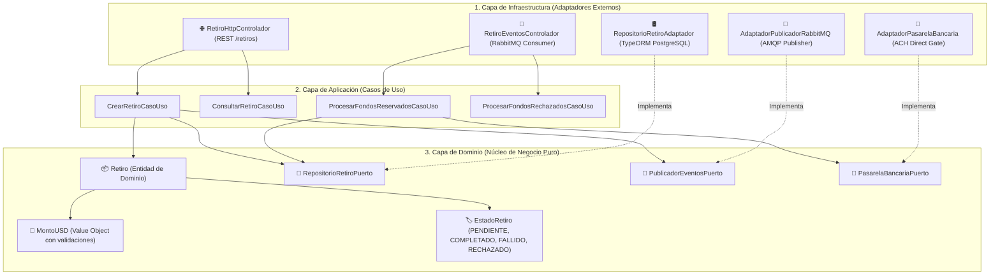
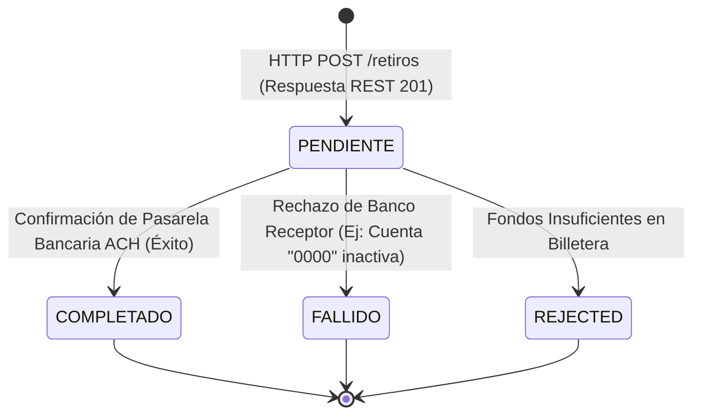

# 📤 Arquitectura Técnica: Microservicio de Retiros USD

Este documento es la **especificación técnica única y consolidada** del **Microservicio de Retiros en Dólares (USD)** (`service-retire-usd`).

---

## 🏛️ 1. Arquitectura Hexagonal & Principios SOLID

El microservicio desacopla el núcleo de negocio de los detalles de infraestructura mediante tres capas:



### **Principios SOLID Aplicados:**
- **Single Responsibility (SRP)**: Casos de uso especializados (`CrearRetiroCasoUso`, `ConsultarRetiroCasoUso`).
- **Open/Closed (OCP)**: Extensión de pasarelas mediante adaptadores sin alterar el dominio.
- **Liskov Substitution (LSP)**: `AdaptadorPasarelaBancaria` sustituye `PasarelaBancariaPuerto`.
- **Interface Segregation (ISP)**: Puertos específicos por responsabilidad (`RepositorioRetiroPuerto`, `PublicadorEventosPuerto`).
- **Dependency Inversion (DIP)**: La aplicación depende de puertos abstractos, no de TypeORM ni RabbitMQ.

---

## 🔄 2. Máquina de Estados & Flujo de Eventos



---

## 🛢️ 3. Modelo de Datos PostgreSQL (`db_servicio_retiros_usd`)

```sql
CREATE TYPE estado_retiro_enum AS ENUM (
  'PENDIENTE',
  'EN_PROCESO',
  'COMPLETADO',
  'RECHAZADO',
  'FALLIDO'
);

CREATE TABLE retiros (
    id UUID PRIMARY KEY DEFAULT gen_random_uuid(),
    usuario_id UUID NOT NULL,
    monto_usd NUMERIC(12, 2) NOT NULL CHECK (monto_usd >= 1.00 AND monto_usd <= 10000.00),
    moneda VARCHAR(3) NOT NULL DEFAULT 'USD',
    codigo_banco VARCHAR(50) NOT NULL,
    cuenta_destino VARCHAR(50) NOT NULL,
    tipo_cuenta VARCHAR(20) NOT NULL DEFAULT 'AHORROS',
    estado estado_retiro_enum NOT NULL DEFAULT 'PENDIENTE',
    referencia_bancaria VARCHAR(100),
    razon_fallo VARCHAR(255),
    fecha_creacion TIMESTAMP WITH TIME ZONE DEFAULT CURRENT_TIMESTAMP,
    fecha_actualizacion TIMESTAMP WITH TIME ZONE DEFAULT CURRENT_TIMESTAMP
);

CREATE INDEX idx_retiros_usuario_id ON retiros(usuario_id);
CREATE INDEX idx_retiros_estado ON retiros(estado);
```

---

## 📡 4. Endpoints REST & Eventos RabbitMQ

### **Endpoints HTTP REST (`http://localhost:3004/retiros`)**
- `POST /retiros`: Registra una nueva solicitud de retiro ($1.00 a $10,000.00 USD).
- `GET /retiros/usuario/:usuarioId`: Consulta el historial completo por UUID de usuario.
- `GET /retiros/:id`: Consulta el detalle específico de una transacción por ID.

### **Eventos RabbitMQ (`withdrawal_queue`)**
- Emite: `withdrawal.requested`, `withdrawal.completed`, `withdrawal.failed`
- Consume: `withdrawal.funds_reserved`, `withdrawal.funds_rejected`

---

## 🧪 5. Pruebas Unitarias (Jest Specs)

Resumen de ejecución de pruebas unitarias (**11 Test Suites pasadas / 29 Tests aprobados**):

```text
PASS src/domain/models/retiro.modelo.spec.ts
PASS src/domain/value-objects/monto-usd.vo.spec.ts
PASS src/application/use-cases/consultar-retiro.caso-uso.spec.ts
PASS src/application/use-cases/crear-retiro.caso-uso.spec.ts
PASS src/application/use-cases/procesar-fondos-rechazados.caso-uso.spec.ts
PASS src/application/use-cases/procesar-fondos-reservados.caso-uso.spec.ts
PASS src/infrastructure/adapters/bank/pasarela-bancaria.adaptador.spec.ts
PASS src/infrastructure/adapters/messaging/publicador-rabbitmq.adaptador.spec.ts
PASS src/infrastructure/adapters/persistence/repositorio-retiro.adaptador.spec.ts
PASS src/infrastructure/controllers/retiro-http.controlador.spec.ts
PASS src/infrastructure/controllers/retiro-eventos.controlador.spec.ts

Test Suites: 11 passed, 11 total
Tests:       29 passed, 29 total
Time:        21.178 s
```

---

## 💻 6. Cliente Web Angular 17

- **Vistas**: Sub-rutas dedicadas para *"Retiros"* (pantalla única sin scroll) e *"Historial Detallado"*.
- **Desembolso**: Toggle selector de cobro en Dólares ($ USD) o Soles (S/ PEN a tasa 3.75).
- **UUID Completo**: Visualización completa del ID `d3b07384-d113-46e4-a123-561234567890`.
