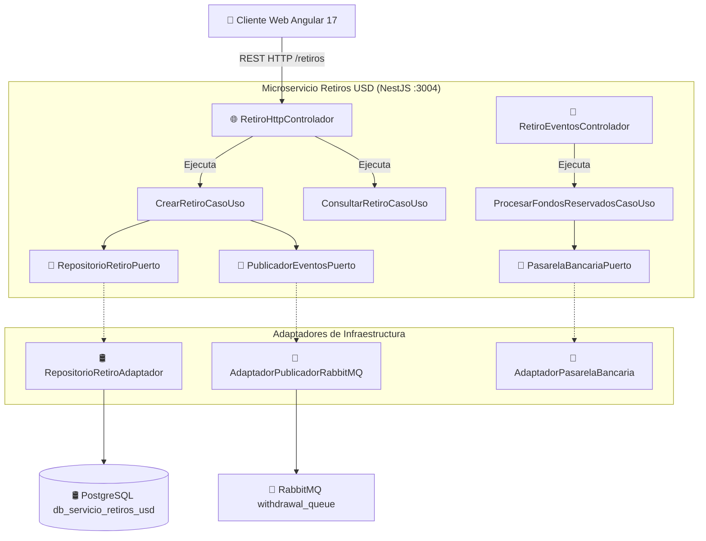
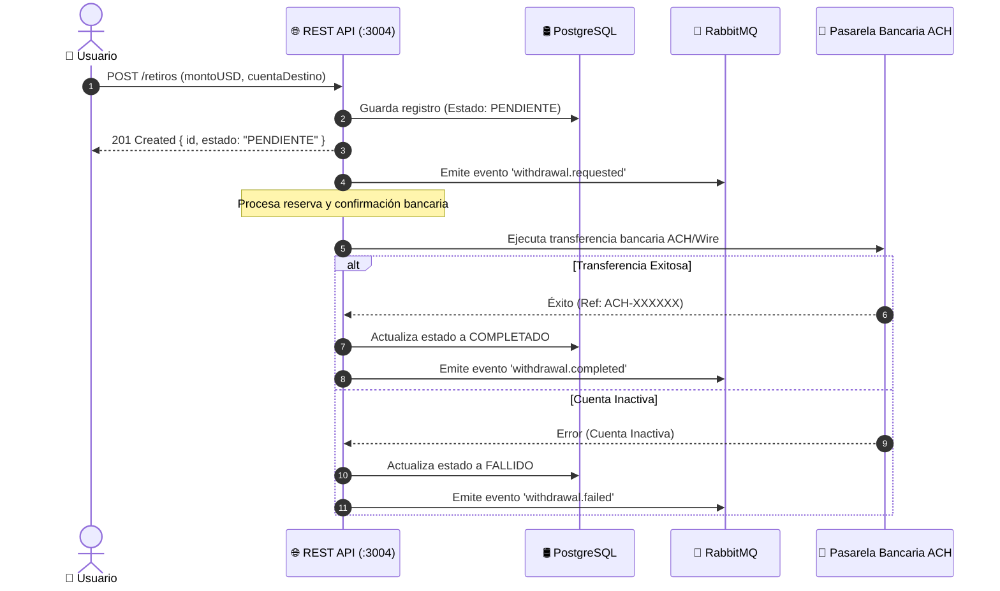

# 🌐 Arquitectura del Microservicio de Retiros USD

Este documento describe la topología de componentes, la **Arquitectura Hexagonal en Capas** y el flujo de comunicación distribuida del **Microservicio de Retiros USD**.

---

## 🏛️ 1. Arquitectura Hexagonal en Capas

```text
+--------------------------------------------------------------------------+
|                 CAPA 1: INFRAESTRUCTURA (ADAPTADORES)                    |
| [🌐 REST Controller]    [📩 RabbitMQ Consumer]    [🏦 Pasarela ACH]     |
| (RetiroHttpControlador) (RetiroEventosControlador) (AdaptadorPasarela)   |
|                                                                          |
| +----------------------------------------------------------------------+ |
| |                  CAPA 2: APLICACIÓN (CASOS DE USO)                   | |
| | * CrearRetiroCasoUso            * ProcesarFondosReservadosCasoUso    | |
| | * ConsultarRetiroCasoUso        * ProcesarFondosRechazadosCasoUso    | |
| |                                                                      | |
| | +------------------------------------------------------------------+ | |
| | |                CAPA 3: DOMINIO (NEGOCIO PURO)                    | | |
| | | 📦 Entidad: Retiro.modelo                                        | | |
| | | 💎 Value Object: MontoUSD.vo ($1.00 - $10,000.00 USD)            | | |
| | | 🏷️ Enum: EstadoRetiro (PENDIENTE, COMPLETADO, FALLIDO, RECHAZADO)| | |
| | | 🔌 Puertos: RepositorioPuerto | PublicadorPuerto | PasarelaPuerto| | |
| | +------------------------------------------------------------------+ | |
| +----------------------------------------------------------------------+ |
|                                                                          |
| [🛢️ PostgreSQL Adaptador DB]            [📩 Productor RabbitMQ AMQP]     |
| (RepositorioRetiroAdaptador)           (AdaptadorPublicadorRabbitMQ)     |
+--------------------------------------------------------------------------+
```

---

## 🏗️ 2. Diagrama de Componentes e Infraestructura



---

## 🔄 3. Comunicación Asíncrona (Event-Driven)


