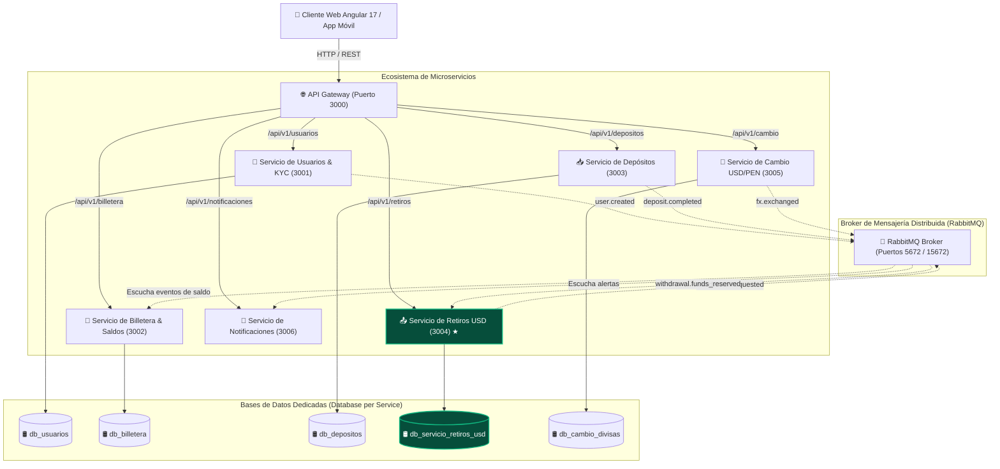
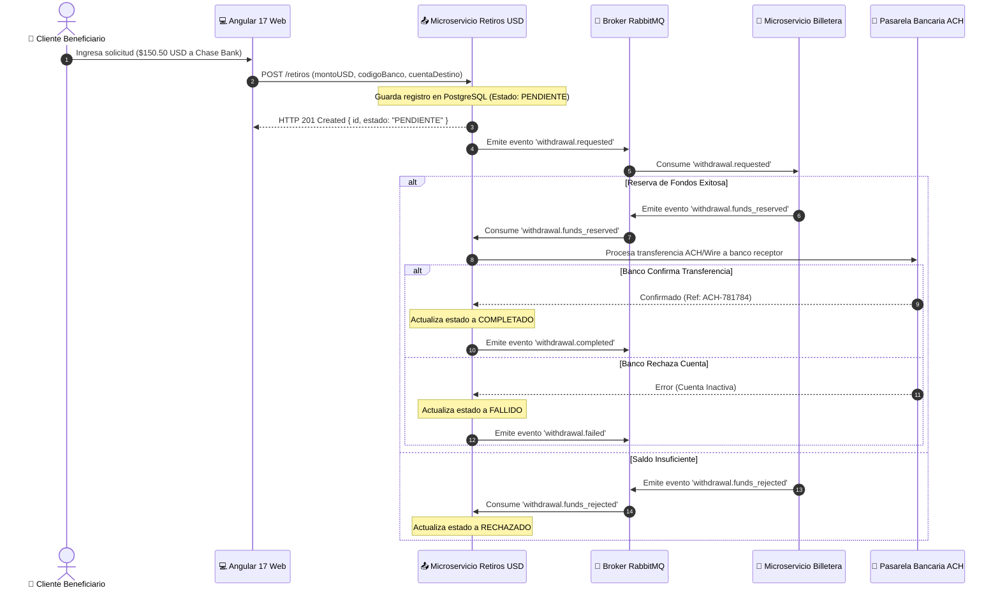

# 🌐 Arquitectura Global del Sistema de Billetera Digital

Este documento presenta la **Arquitectura Global de Microservicios** para la Plataforma de Billetera Digital en Dólares (USD) y Soles (PEN), detallando la topología completa del sistema, los dominios de cada servicio, la orquestación distribuida y la comunicación orientada a eventos.

---

## 🏗️ 1. Diagrama de Arquitectura Global de Microservicios



---

## 📋 2. Catálogo de Microservicios del Ecosistema

| Microservicio | Puerto | Responsabilidades Principales | Base de Datos | Estado de Implementación |
| :--- | :---: | :--- | :--- | :---: |
| **👤 Usuarios & KYC** | `3001` | Autenticación JWT, registro de clientes, verificación KYC nivel 1-3. | PostgreSQL `db_usuarios` | Próximamente (Sprint Futuro) |
| **💼 Billetera & Saldos** | `3002` | Gestión de cuentas contables, saldos multi-moneda (USD/PEN), reservas temporales de fondos. | PostgreSQL `db_billetera` | Próximamente (Sprint Futuro) |
| **📥 Depósitos** | `3003` | Recargas de dinero en dólares vía tarjeta de crédito/débito o transferencia bancaria. | PostgreSQL `db_depositos` | Próximamente (Sprint Futuro) |
| **📤 Retiros USD** | `3004` | **Gestión integral de retiros en Dólares (USD), conversión de desembolso PEN y procesamiento bancario ACH.** | PostgreSQL `db_servicio_retiros_usd` | **100% Activo & Operativo (Taller 2)** |
| **🔱 Cambio USD/PEN** | `3005` | Compra y venta de divisas en tiempo real a tasa de cambio de mercado. | PostgreSQL `db_cambio_divisas` | Próximamente (Sprint Futuro) |
| **🔔 Notificaciones** | `3006` | Envío de correos electrónicos, notificaciones Push y SMS transaccionales. | Redis / NoSQL | Próximamente (Sprint Futuro) |

---

## 🔄 3. Matriz de Eventos y Comunicaciones (Event-Driven Architecture)



---

## ⚙️ 4. Orquestación y Despliegue con Docker Compose

La infraestructura completa se ejecuta de manera aislada utilizando **Docker Compose**:

```yaml
services:
  servicio-mensajeria-rabbitmq:
    image: rabbitmq:3-management-alpine
    container_name: broker-mensajeria-rabbitmq
    ports:
      - "5672:5672"     # AMQP
      - "15672:15672"   # Management Dashboard

  postgres-servicio-retiros-usd:
    image: postgres:15-alpine
    container_name: contenedor-postgres-servicio-retiros-usd
    environment:
      POSTGRES_DB: db_servicio_retiros_usd
    ports:
      - "5432:5432"

  servicio-retiros-usd:
    build: ./retiros-usd-service
    container_name: contenedor-servicio-retiros-usd
    ports:
      - "3004:3004"

  frontend-web:
    build: ./frontend
    container_name: contenedor-frontend-web
    ports:
      - "4200:80"
```
